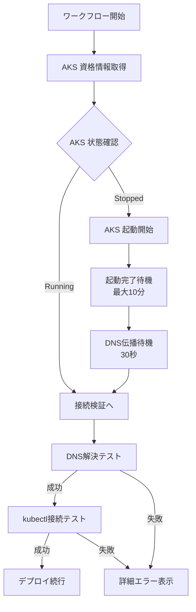

# AKS DNS 解決失敗のトラブルシューティング

## 📋 問題の概要

Board App Build & Deploy ワークフローの「AKS 接続を検証」ステップで以下のエラーが発生：

```
server can't find aksdemodev-nxzok1nt.hcp.japaneast.azmk8s.io: NXDOMAIN
❌ DNS 解決に失敗しました
```

## 🔍 問題の原因

AKS API サーバーの DNS 名が解決できない原因は以下のいずれか：

### 1. **AKS クラスターが停止中** ⭐ 最も可能性が高い
- AKS クラスターが停止状態（`Stopped`）の場合、API サーバーの DNS 名は解決できません
- Azure Portal または Azure CLI で停止操作が行われた可能性があります
- コスト削減のために意図的に停止されている場合もあります

### 2. **DNS 伝播の遅延**
- AKS クラスターの起動直後は DNS が完全に伝播していない場合があります
- 通常は起動後 1-2 分で解決可能になります

### 3. **AKS クラスターの再作成**
- Infrastructure Deploy ワークフローで AKS クラスターが削除・再作成された場合、新しい FQDN が生成されます
- 古い kubeconfig が残っている場合、古い FQDN への接続を試みて失敗します

### 4. **ネットワーク構成の問題**
- Private Cluster として構成されている場合、GitHub Actions からアクセスできません
- API Server Access Profile の設定が正しくない可能性があります

## ✅ 修正内容

### 自動起動機能の追加

**修正前：**
- AKS クラスターが停止していても検出できず、DNS 解決失敗で終了

**修正後：**
1. AKS クラスターの状態（`powerState`）を確認
2. `Stopped` 状態の場合は自動的に起動（`az aks start`）
3. 起動完了まで待機（最大 10 分）
4. DNS 伝播を待つために追加で 30 秒待機
5. その後、通常の接続検証を実行

### エラーメッセージの改善

DNS 解決に失敗した場合、以下の情報を表示：
- 考えられる原因の一覧
- AKS クラスターの詳細情報（状態、FQDN、バージョンなど）
- 推奨される対応手順

## 🛠️ 手動での対応方法

### AKS クラスターの状態を確認

```bash
az aks show \
  --resource-group RG-BBS-Appzz \
  --name aks-demo-dev \
  --query '{
    provisioningState: provisioningState,
    powerState: powerState.code,
    fqdn: fqdn
  }' \
  -o json
```

### AKS クラスターを起動

```bash
# 起動開始（非同期）
az aks start \
  --resource-group RG-BBS-Appzz \
  --name aks-demo-dev \
  --no-wait

# 起動完了を待機
az aks wait \
  --resource-group RG-BBS-Appzz \
  --name aks-demo-dev \
  --custom "powerState.code=='Running'" \
  --timeout 600
```

### AKS クラスターを停止（コスト削減）

```bash
az aks stop \
  --resource-group RG-BBS-Appzz \
  --name aks-demo-dev
```

## 📊 想定される動作フロー



## 🎯 期待される効果

1. **自動復旧**: AKS が停止していても自動的に起動してデプロイを継続
2. **明確なエラー**: 失敗時に原因と対応方法が明示される
3. **コスト最適化**: 停止機能を使ってコスト削減しつつ、必要時に自動起動

## 📝 関連リンク

- [Azure AKS Start/Stop](https://learn.microsoft.com/ja-jp/azure/aks/start-stop-cluster)
- [AKS Troubleshooting](https://learn.microsoft.com/ja-jp/troubleshoot/azure/azure-kubernetes/welcome-azure-kubernetes)
- [GitHub Issue #64](https://github.com/aktsmm/container-app-demo/issues/64)

## 🔄 検証結果

- 修正日: 2025-11-23
- 修正者: Copilot
- テスト状態: 未検証（次回ワークフロー実行時に確認）
